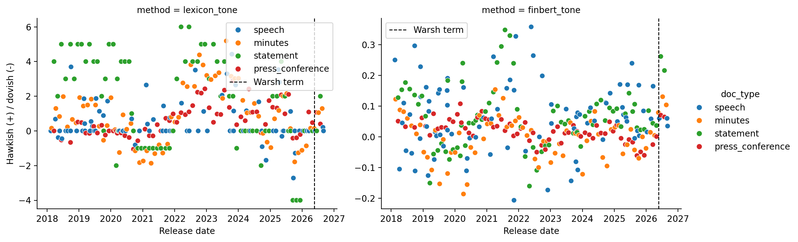

# Evaluating the Impact of FOMC Communications on Asset Prices

**FRE-GY 7871 A - NLP and the Investment Process**  
**Name:** Alan Wang
**NetID** aw4437
**GitHub repo:** https://github.com/alanywang25/FRE-GY-7871A-Assignment2

## Executive summary

The sample contains 297 documents: FOMC statements and minutes, press-conference transcripts, and Chair speeches. Warsh-era communication is generally non-dovish under the word-list and FinBERT measures, but the current Warsh sample remains only nine documents. For inference, same-day releases are combined, yielding 228 event days. Across the word-list, FinBERT, and factor-similarity measures, no tone coefficient is statistically significant at conventional levels for DXY, 10s2s, the 1-year yield, or growth minus value. The defensible result is weak and method-sensitive evidence, not a directional trading signal. The base case used is a September **hold** and a 65% chance of a more hawkish statement. The market projections below are illustrative lexicon scenarios, not a standalone investment signal.

## Data and methods

The sample begins in February 2018. Powell is the baseline Chair through May 21, 2026; the Warsh period begins May 22, 2026. Documents come from Federal Reserve calendars, historical materials, press-conference transcripts, and speech archives. The one-day outcomes are DXY, 10s2s, the 1-year Treasury yield, and IWF-minus-IWN. Regressions include the DGS3MO change, separating text-tone associations from contemporaneous short-rate news.

Tone is measured three ways: a monetary-policy hawkish/dovish word list normalized by document length; sentence-level FinBERT sentiment (positive minus negative probability); and a TF-IDF/cosine-similarity score against hawkish and dovish seed language. Table 3 uses one row per event day, averaging tone measures where multiple communications share that day. 

## Table 1. Documents collected, by type and Chair

| Document type | Powell | Warsh |
|---|---:|---:|
| Minutes | 67 | 2 |
| Press-conference transcripts | 63 | 2 |
| Chair speeches | 86 | 3 |
| Post-meeting statements | 72 | 2 |

## Figure 1. Hawkish/dovish tone over time by document type

The figure displays the two directly comparable document-level scores. The word-list series is positive for the July statement (2.000), August minutes (1.291), and June press conference (1.065). FinBERT readings for the same documents are modestly positive (0.216, 0.104, and 0.070). This supports a descriptive conclusion that recent communication is not strongly dovish; it does not establish a market effect. The factor-similarity measure is reported in Table 3 as a robustness specification.

## Table 2. One-day market changes after each Warsh-era release

DXY and growth-minus-value are percentage changes. Treasury values and 10s2s are percentage-point changes. Speech timestamps shown at noon are provisional.

| Release | Type | Lexicon | FinBERT | DXY | 10s2s | 1-year | Growth minus value |
|---|---|---:|---:|---:|---:|---:|---:|
| 2026-05-31 12:00 | Speech | 0.000 | 0.060 | 0.293 | -0.050 | 0.040 | 1.248 |
| 2026-06-17 14:00 | Statement | 0.000 | 0.261 | 0.553 | -0.090 | 0.140 | -0.258 |
| 2026-06-17 14:00 | Press conference | 1.065 | 0.070 | 0.553 | -0.090 | 0.140 | -0.258 |
| 2026-07-08 14:00 | Minutes | 1.053 | 0.130 | -0.089 | -0.010 | 0.000 | 1.506 |
| 2026-07-29 14:00 | Press conference | 0.401 | 0.065 | -0.572 | 0.100 | -0.050 | -0.966 |
| 2026-07-29 14:00 | Statement | 2.000 | 0.216 | -0.572 | 0.100 | -0.050 | -0.966 |
| 2026-08-19 14:00 | Minutes | 1.291 | 0.104 | -0.823 | -0.060 | 0.010 | -0.842 |
| 2026-08-28 12:00 | Speech | 0.208 | 0.060 | 0.545 | -0.080 | 0.110 | -0.208 |
| 2026-09-03 12:00 | Speech | 0.000 | 0.035 | -0.562 | 0.030 | -0.050 | 1.025 |

The same-day statement and press-conference rows deliberately share a market move: they were released on the same announcement date. They should not be treated as independent events in a final inference exercise.

## Table 3. One-day regressions with the 3-month bill control

Each row regresses the one-day outcome on one tone score and DGS3MO, using HC3 robust standard errors. Same-day communications are aggregated before estimation, so the 228 observations are event days rather than documents.

| Indicator | Tone method | N | Tone beta | Tone p-value | DGS3MO beta | R-squared |
|---|---|---:|---:|---:|---:|---:|
| DXY | Lexicon | 228 | -0.023 | 0.214 | 3.425 | 0.061 |
| DXY | FinBERT | 228 | 0.322 | 0.336 | 3.454 | 0.060 |
| DXY | Factor similarity | 228 | -1.871 | 0.609 | 3.474 | 0.056 |
| 10s2s | Lexicon | 228 | -0.002 | 0.344 | -0.388 | 0.081 |
| 10s2s | FinBERT | 228 | -0.027 | 0.365 | -0.379 | 0.079 |
| 10s2s | Factor similarity | 228 | -0.041 | 0.932 | -0.383 | 0.076 |
| 1-year Treasury yield | Lexicon | 228 | -0.001 | 0.446 | 0.844 | 0.271 |
| 1-year Treasury yield | FinBERT | 228 | -0.002 | 0.938 | 0.848 | 0.269 |
| 1-year Treasury yield | Factor similarity | 228 | -0.301 | 0.340 | 0.845 | 0.272 |
| Growth minus value | Lexicon | 228 | 0.087 | 0.144 | 1.058 | 0.011 |
| Growth minus value | FinBERT | 228 | -1.380 | 0.128 | 0.973 | 0.011 |
| Growth minus value | Factor similarity | 228 | -16.334 | 0.106 | 0.667 | 0.011 |

All 12 tone coefficients have p-values above 0.10. Growth-minus-value remains the closest case—positive for the lexicon and negative for FinBERT and factor similarity—but its sign is method-dependent and its estimated relationship is not conventionally significant. The short-rate control explains more variation in the 1-year yield than text does, while every tone specification has low explanatory power. These results do not support a directional trade based on communication tone alone.

## Comparison with the readings

Doh, Kim, and Yang (2021) argue that qualitative statement language can move financial conditions independently of the target-rate decision. This project uses DGS3MO as a control in the same spirit, but its broad daily window and mixed document types produce weaker yield results. The disagreement between the lexicon and FinBERT results also reinforces their concern that measuring policy language is not straightforward. [Doh, Kim, and Yang (2021)](https://www.kansascityfed.org/documents/7577/erv106n1dohkimyang.pdf)

Doh, Song, and Yang separate tone, novelty, and the surprise component using alternative FOMC statements and high-frequency data. This project improves on a single word list by adding FinBERT, but it still uses absolute tone and daily returns. It cannot make their counterfactual or surprise-based causal claims. Adding novelty, a narrow event window, and clustered treatment of same-day
statement/press-conference pairs would improve the design. [Doh, Song, and Yang](https://www.kansascityfed.org/documents/5642/rwp20-14dohsongyang.pdf)

The *Parsing the Fed* comparison includes a factor-similarity robustness measure alongside the word-list and FinBERT scores. Its results do not rescue a directional conclusion: its coefficients are also statistically weak. The exercise therefore illustrates why measurement choice, release timing, and event-window design matter more than selecting a preferred text score.

## September FOMC forecast

### Rate decision

| Cut | Hold | Hike |
|---:|---:|---:|
| 20% | 75% | 5% |

The hold remains the modal outcome. Communication-tone evidence does not itself identify a policy-rule change, and the small Warsh sample argues against a more aggressive rate call.

### Statement tone

There is a **65% probability** that the September statement is more hawkish than the prior statement. Recent Warsh communications are generally positive on both scores, though the modest FinBERT magnitudes argue against a high-confidence hawkish surprise.

### Market reaction

The current lexicon-based forecast uses the latest statement tone scenario.

| Indicator | Probability it rises | Expected one-day change |
|---|---:|---:|
| DXY | 44.3% | -0.060% |
| 10s2s spread | 43.2% | -0.007 percentage points |
| 1-year Treasury yield | 48.6% | -0.001 percentage points |
| Growth minus value | 53.7% | +0.115% |

These are lexicon-based scenario estimates, not a consensus forecast. FinBERT and factor similarity point in the opposite direction for growth minus value, and no event-level tone coefficient is conventionally significant. The point estimates should therefore be read as a transparent mechanical mapping from the latest statement tone, not as evidence of an expected tradeable return.

## Recommendation and falsification

**Position:** take a *very small* long-IWF/short-IWN position (long growth minus value) ahead of the meeting.

**Why:** This is a deliberately low-conviction scenario trade, not a statistically supported signal. The latest-statement lexicon mapping assigns growth minus value the highest probability of rising (53.7%) and an expected one-day move of +0.115%. However, after aggregating same-day communications, the lexicon estimate is not significant (p = 0.144), while FinBERT and factor similarity have the opposite sign. Position size should therefore be small enough that the trade is expendable.

**What proves it wrong:** Close the position if statement-day growth-minus-value is -0.50% or lower, or if the 1-year Treasury yield rises by at least 10 basis points. Either outcome contradicts the mild lexicon scenario. More fundamentally, a revised design with verified timestamps and a consistent, statistically supported result across the three methods would supersede this tentative recommendation.
